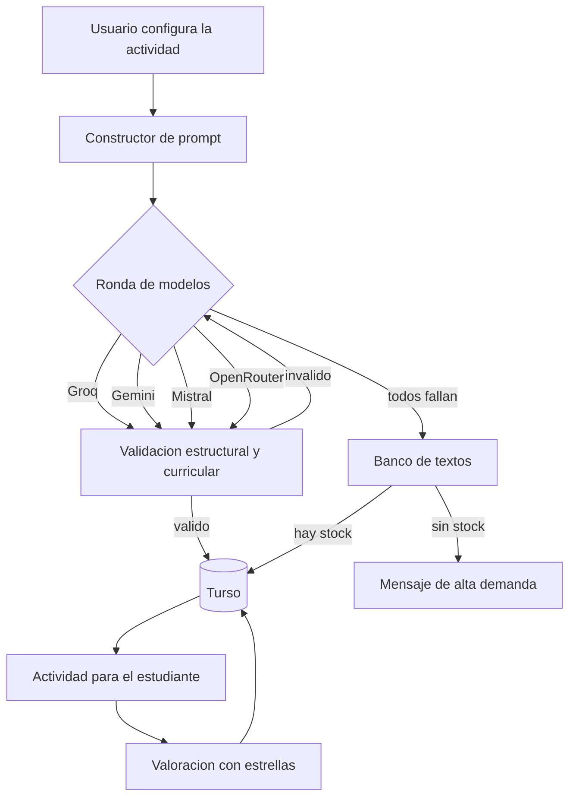

<div align="center">

# L+IA

**Lectura + Inteligencia Artificial**

### Comprende. Practica. Avanza.

<p>
  
  
  
  
  
  
</p>

Plataforma educativa chilena para desarrollar habilidades lectoras, construida sobre el
**Currículum Nacional** y potenciada por **inteligencia artificial** como motor de personalización.

</div>

---

## Tabla de contenidos

- [Qué es L+IA](#qué-es-lia)
- [Aviso sobre el contenido generado](#-aviso-sobre-el-contenido-generado)
- [Funcionalidades](#funcionalidades)
- [Marco curricular](#marco-curricular)
- [Arquitectura](#arquitectura)
- [Stack](#stack)
- [Instalación](#instalación)
- [Variables de entorno](#variables-de-entorno)
- [Base de datos](#base-de-datos)
- [Modelos de IA](#modelos-de-ia)
- [Estructura del proyecto](#estructura-del-proyecto)
- [API](#api)
- [Scripts](#scripts)
- [Hoja de ruta](#hoja-de-ruta)
- [Autor](#autor)

---

## Qué es L+IA

**L** es Lectura, **IA** es Inteligencia Artificial y el signo **+** representa la integración: la
tecnología *se suma* al proceso educativo, no reemplaza al docente ni convierte la lectura en una
interacción exclusivamente tecnológica.

> L+IA no es simplemente una IA que genera textos y preguntas.
> Es una plataforma pedagógica que utiliza IA para adaptar la práctica de la lectura.

La diferenciación no está en usar inteligencia artificial, sino en la **estructura pedagógica que
determina cómo se usa**:

```text
Currículum chileno → Nivel educativo → Objetivos de Aprendizaje → Habilidades lectoras
   → Indicadores → Generación con IA → Validación automática → Actividad
   → Retroalimentación → Valoración de usuarios → Nueva práctica
```

### Una plataforma, dos propósitos

| | Público | Propósito |
|---|---|---|
| 🎒 | **Estudiantes y familias** | Practicar lectura en casa o en la escuela con actividades adecuadas al nivel, sin necesitar conocimientos pedagógicos |
| 🍎 | **Docentes** | Generar y reutilizar material variado, adaptado a las características de cada curso |

---

## ⚠️ Aviso sobre el contenido generado

Todos los textos, preguntas, alternativas y explicaciones de la plataforma **son escritos por
modelos de inteligencia artificial**. Por eso la información **no siempre es correcta**: puede tener
datos equivocados, imprecisos o incompletos.

Este aviso es visible de forma permanente en la aplicación: en la portada, en la biblioteca, en la
pantalla de práctica, junto a cada texto de lectura, en el pie de página, en el informe PDF y en la
propia conversación con L+IA.

La calidad se controla en tres capas, y **ninguna de las dos primeras garantiza veracidad**:

1. **Estructural** — el resultado debe cumplir el esquema exacto (Zod).
2. **Curricular** — se rechaza el texto si se sale del rango de palabras del nivel, si usa
   habilidades ajenas al curso, si repite alternativas, si el índice de la respuesta correcta es
   inválido o si deja sin cubrir un eje solicitado.
3. **Humana** — estudiantes y docentes valoran con estrellas cada texto y cada pregunta; esa
   valoración decide qué se conserva en la biblioteca y qué se retira.

---

## Funcionalidades

### Modo conversación

L+IA guía la actividad completa como un chat: pregunta el curso, la unidad temática, el tipo de
texto, la extensión, la cantidad de preguntas y las habilidades; entrega la lectura, formula las
preguntas una a una y cierra con el resultado.

- **Registro por edad**: el lenguaje cambia entre 2º-4º básico y 6º en adelante, manteniendo la
  misma identidad de marca.
- **Lectura en voz alta**: se ofrece al inicio y queda guardada. Selecciona automáticamente una voz
  femenina de español latinoamericano entre las disponibles del sistema. Cada mensaje, el texto y
  cada alternativa tienen su propio botón de escucha.
- **Cierre celebratorio**: serpentinas cuando se supera el umbral de logro, mensaje según el
  desempeño y un consejo de lectura extraído de una red de consejos por nivel y por eje.

### Modo docente

Panel completo para configurar todos los parámetros de una vez, con el marco curricular del nivel a
la vista: foco pedagógico, Objetivos de Aprendizaje con su enunciado oficial y mecánica de
interacción sugerida.

### Biblioteca

Todas las actividades generadas quedan guardadas y disponibles. Cada tarjeta muestra cómo está
construida: nivel, unidad, tipo de texto, extensión, cantidad de preguntas, Objetivos de
Aprendizaje, ejes evaluados, modelo que la produjo, estado y valoración acumulada. Cualquier texto
puede abrirse directamente para practicar.

### Informe de resultados

- Porcentaje de comprensión contra el umbral del **70%**.
- Velocidad lectora en **palabras por minuto**, clasificada en los seis tramos del nivel.
- Logro desagregado **por eje** y **por Objetivo de Aprendizaje**.
- Detalle de cada pregunta con la respuesta marcada, la correcta y su explicación.
- **Exportación a PDF** con membrete, datos de la actividad y numeración de páginas.

### Accesibilidad e interfaz

Tema claro y oscuro con preferencia persistente, control de tamaño de letra durante la lectura,
enlace para saltar al contenido y roles ARIA en los controles interactivos.

---

## Marco curricular

El proyecto se construyó sobre una guía técnica elaborada con un equipo de docentes y programadores,
que traduce las Bases Curriculares del MINEDUC en especificaciones utilizables por software.

### Niveles focalizados

Se trabaja solo con los cursos que cuentan con métricas oficiales: **2º, 4º, 6º y 8º básico y 2º
medio**. Se prefiere ofrecer menos niveles con datos verificados antes que estimar rangos que se
traduzcan en exigencias arbitrarias.

### Velocidad lectora (PPM)

| Nivel | Muy lenta | Lenta | Medio baja | Medio alta | Rápida | Muy rápida |
|---|---|---|---|---|---|---|
| 2º básico | < 43 | 43-57 | 58-72 | 73-88 | 89-103 | > 103 |
| 4º básico | < 85 | 85-99 | 100-114 | 115-129 | 130-144 | > 144 |
| 6º básico | < 118 | 118-132 | 133-147 | 148-162 | 163-177 | > 177 |
| 8º básico | < 145 | 145-159 | 160-174 | 175-189 | 190-204 | > 204 |
| 2º medio | < 162 | 162-176 | 177-191 | 192-206 | 207-221 | > 221 |

### Extensión de textos (palabras)

| Nivel | Básica | Media | Avanzada |
|---|---|---|---|
| 2º básico | 50-80 | 81-120 | 121-150 |
| 4º básico | 150-200 | 201-300 | 301-400 |
| 6º básico | 300-400 | 401-600 | 601-800 |
| 8º básico | 500-650 | 651-900 | 901-1200 |
| 2º medio | 800-1000 | 1001-1400 | 1401-1800 |

### Ejes de Lectura

Toda habilidad evaluada pertenece a uno de los tres ejes del currículum: **localizar información**,
**relacionar e interpretar información** y **reflexionar sobre el texto**. Cada habilidad está
vinculada al Objetivo de Aprendizaje que le corresponde en ese nivel.

---

## Arquitectura

La generación y el consumo están separados. Cuando se solicita una actividad, la API consulta los
modelos en cadena; si ninguno entrega un resultado válido, recurre al banco de textos; y si tampoco
hay coincidencias, informa la falta de disponibilidad.



Cada intento contra un modelo queda registrado en la tabla `generaciones` con su latencia, tokens y
motivo de fallo, lo que permite comparar proveedores con datos reales.

---

## Stack

| Capa | Tecnología |
|---|---|
| Framework | Next.js 15 (App Router) |
| UI | React 19 · Tailwind CSS 4 con tokens semánticos |
| Base de datos | Turso (libSQL) con Prisma 7 y adaptador `@prisma/adapter-libsql` |
| Validación | Zod |
| IA | Groq · Google AI Studio · Mistral · OpenRouter |
| Voz | Web Speech API |
| PDF | `@react-pdf/renderer` |

---

## Instalación

Requisitos: **Node.js 20 o superior** y npm.

```bash
git clone <url-del-repositorio>
cd lectura_app
npm install
cp .env.example .env.local   # completa tus credenciales
npm run db:push              # crea las tablas en Turso
npm run dev
```

La aplicación queda disponible en `http://localhost:3000`.

---

## Variables de entorno

Las credenciales se centralizan en `src/lib/env.js`, marcado con `server-only`: si alguien lo
importa desde un componente cliente, el build falla. **Ninguna variable lleva el prefijo
`NEXT_PUBLIC_`**, por lo que nunca llegan al navegador.

```bash
# Turso (libSQL)
TURSO_DATABASE_URL="libsql://<tu-base>.turso.io"
TURSO_AUTH_TOKEN="<token-de-turso>"

# Proveedores de IA (basta con uno para operar)
GROQ_API_KEY=""
GEMINI_API_KEY=""
OPENROUTER_API_KEY=""
MISTRAL_API_KEY=""

# Modelos (opcional, tienen valores por defecto)
GROQ_MODEL="openai/gpt-oss-120b"
GEMINI_MODEL="gemini-3.6-flash"
MISTRAL_MODEL="mistral-small-latest"
OPENROUTER_MODEL="google/gemma-4-31b-it:free"

# Sirve solo textos aprobados en la biblioteca (producción)
SOLO_TEXTOS_APROBADOS="0"
```

---

## Base de datos

El esquema vive en `prisma/schema.prisma` y se aplica con `npm run db:push`, que ejecuta
`prisma/schema.sql` contra Turso mediante el cliente libSQL. Todas las sentencias usan
`CREATE ... IF NOT EXISTS`, por lo que la operación **nunca destruye datos existentes**.

| Tabla | Contenido |
|---|---|
| `textos` | Texto, metadatos curriculares, estado y modelo que lo generó |
| `preguntas` | Enunciado, alternativas, respuesta correcta, explicación, habilidad, eje y OA |
| `generaciones` | Trazabilidad de cada llamada: proveedor, modelo, latencia, tokens y errores |
| `valoraciones_texto` | Estrellas y comentarios sobre cada texto |
| `valoraciones_pregunta` | Estrellas y comentarios sobre cada pregunta |

---

## Modelos de IA

Los cuatro proveedores exponen una interfaz compatible con OpenAI, por lo que comparten un único
adaptador. La ronda se recorre en orden hasta obtener una actividad válida.

| Proveedor | Modelo por defecto | Notas |
|---|---|---|
| Groq | `openai/gpt-oss-120b` | El más rápido. Requiere `reasoning_effort: low` para devolver JSON |
| Google AI Studio | `gemini-3.6-flash` | Buen rendimiento en español |
| Mistral | `mistral-small-latest` | Créditos mensuales en el plan gratuito |
| OpenRouter | `google/gemma-4-31b-it:free` | Agregador; los modelos gratuitos se saturan con frecuencia |

> **Importante**: revisa los términos de uso de cada proveedor antes de un despliegue comercial.
> Algunas capas gratuitas utilizan los prompts para entrenamiento o restringen su uso en
> aplicaciones dirigidas a menores de edad. La arquitectura de L+IA mitiga esto último: las llamadas
> las realiza el servidor y el estudiante consume desde la base de datos.

---

## Estructura del proyecto

```text
lectura_app/
├─ prisma/
│  ├─ schema.prisma          # Fuente de verdad del modelo de datos
│  └─ schema.sql             # DDL aplicado a Turso
├─ scripts/
│  ├─ db-push.mjs            # Crea las tablas en Turso
│  ├─ db-check.mjs           # Verifica la conexión Prisma + Turso
│  └─ ia-log.mjs             # Historial de generaciones por proveedor
├─ src/
│  ├─ app/
│  │  ├─ api/
│  │  │  ├─ actividad/       # Orquestador: IA → banco → mensaje
│  │  │  ├─ generar/         # Generación directa con IA
│  │  │  ├─ textos/          # Banco de textos y detalle por id
│  │  │  ├─ valoraciones/    # Estrellas y comentarios
│  │  │  └─ estado/          # Diagnóstico de conexión
│  │  ├─ app/                # Aplicación de práctica
│  │  ├─ biblioteca/         # Listado de textos guardados
│  │  ├─ about/ faq/ contact/ privacy-policy/
│  │  ├─ opengraph-image.jsx # Imagen social generada
│  │  ├─ sitemap.js robots.js manifest.js
│  │  └─ layout.js           # Metadata, JSON-LD, tema y voz
│  ├─ components/
│  │  ├─ chat/               # Conversación, cierre, serpentinas, valoración
│  │  ├─ layout/             # Navbar, footer, logo, tema
│  │  ├─ pdf/                # Plantilla del informe
│  │  └─ voz/                # Contexto y botón de lectura en voz alta
│  ├─ data/
│  │  ├─ curriculum.js       # Niveles, OA, habilidades, PPM y extensiones
│  │  ├─ consejos.js         # Red de consejos por nivel y eje
│  │  └─ site.js             # Contenido del sitio y FAQ
│  └─ lib/
│     ├─ ia/                 # Prompt, proveedores, esquema, router, orquestador
│     ├─ db.js env.js        # Acceso a datos y credenciales (server-only)
│     ├─ desempeno.js        # Cálculo de logro por eje y OA
│     └─ guion.js            # Mensajes de L+IA por registro de edad
└─ public/images/            # Ilustraciones de la interfaz
```

---

## API

| Método | Ruta | Descripción |
|---|---|---|
| `POST` | `/api/actividad` | Punto de entrada del front: genera con IA y, si falla, recurre al banco |
| `POST` | `/api/generar` | Fuerza la generación con IA. Acepta `proveedor` para pruebas |
| `GET` | `/api/generar` | Lista los modelos configurados |
| `GET` | `/api/textos` | Banco de textos con filtros y valoraciones |
| `GET` | `/api/textos/[id]` | Detalle de un texto con sus preguntas |
| `POST` | `/api/valoraciones` | Registra estrellas y comentarios |
| `GET` | `/api/estado` | Diagnóstico de conexión y proveedores activos |

<details>
<summary>Ejemplo de solicitud</summary>

```bash
curl -X POST http://localhost:3000/api/actividad \
  -H "Content-Type: application/json" \
  -d '{
    "nivel": "6basico",
    "unidad": "u2",
    "tipoTexto": "informativo",
    "dificultad": "media",
    "cantidadPreguntas": 5,
    "habilidades": ["localizar_explicita", "inferencia_compleja", "comparar_textos"]
  }'
```

</details>

---

## Scripts

| Comando | Acción |
|---|---|
| `npm run dev` | Servidor de desarrollo |
| `npm run build` | Compilación de producción |
| `npm run start` | Ejecuta la versión compilada |
| `npm run lint` | Análisis estático |
| `npm run db:push` | Aplica el esquema en Turso |
| `npm run db:check` | Verifica lectura y escritura |
| `node scripts/ia-log.mjs` | Historial y tasa de éxito por proveedor |

---

## Hoja de ruta

- [ ] Cuentas de estudiante con seguimiento del progreso en el tiempo
- [ ] Desafíos compartidos por código entre docente y curso
- [ ] Generación a partir de una necesidad pedagógica descrita en lenguaje natural
- [ ] Mecánicas de interacción por nivel: medición de fluidez por voz, subrayado activo validado,
      mapas semánticos, verificación de hechos y análisis de falacias
- [ ] Panel de curaduría para aprobar y retirar textos según valoraciones

---

## Autor

Desarrollado por **José Valdés**, profesor y desarrollador.

- Correo: profe.josevaldes@gmail.com
- LinkedIn: [José Valdés Romero](https://www.linkedin.com/in/jos%C3%A9-vald%C3%A9s-romero-58b7a5208/)

<div align="center">

**L+IA** · Comprende. Practica. Avanza.

*Alineado al Currículum Nacional de Chile*

</div>
